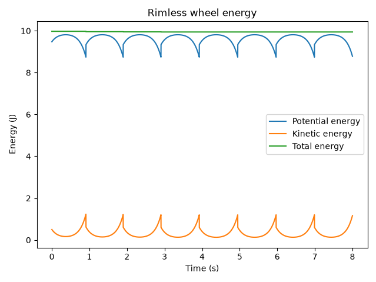
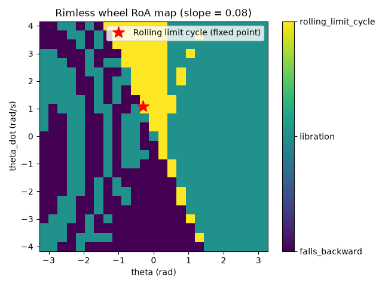
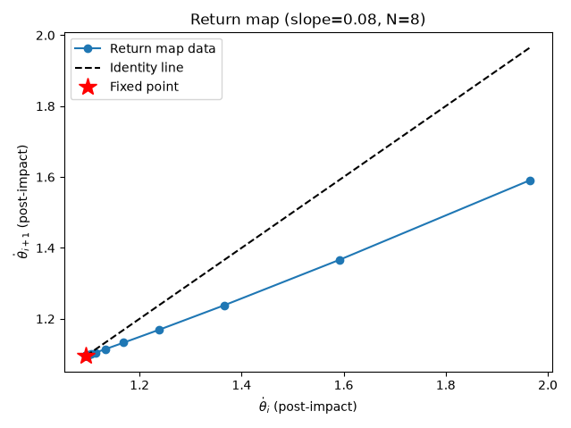
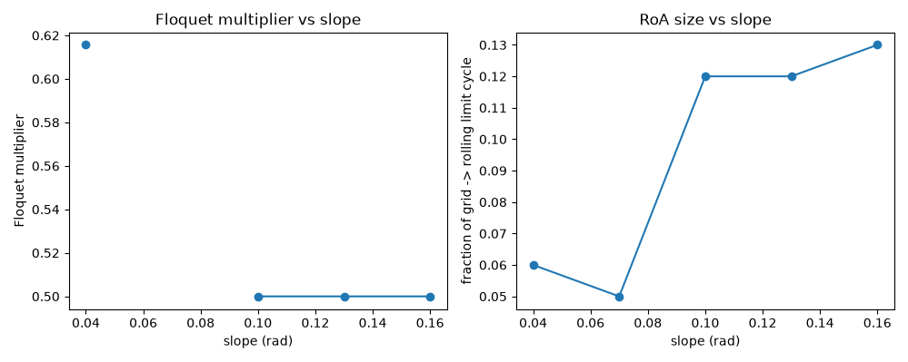
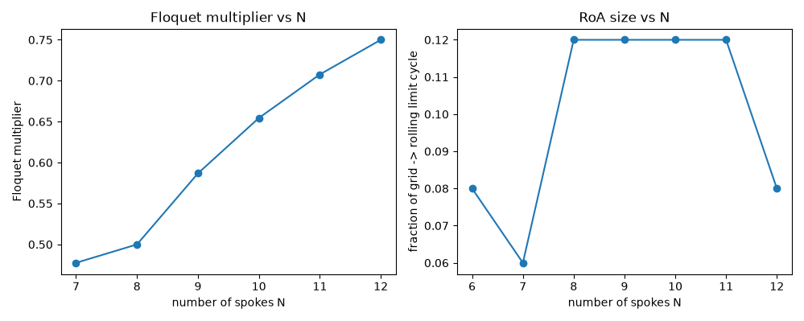

## Model Sanity Checks
I ran a simple energy conversation check with the inital condition  
$[\theta, \dot{\theta}]$ = $[0, 1 \frac{rad}{s}]$  
I expected to see the total energy decrease with every collision, since it is perflectly plastic. While you can see this in the kinetic energy, I forgot to account for the fact that a the reset it also gains potential energy. This resulted in engery staying relatively constant throguhout the simulation. The below figure can be generated with  
```
uv run assignment_1a.py
```
  


## State-Space Plot showing the RoA of every stable attractor

The below plot can be generated with  
```
uv run assignment_1b.py
```

  

## One-Dimensional Return-map plot

All remaining plots can be generated with  
```
uv run assignment_1c.py
```

  


## How RoA is affected by wheel parameters
  

This figure shows the Floquet multiplier as indepent of the slope from 0.10-0.16, which matches the theoretical prediction that it should only depend on $cos^2(2\alpha)$ instead of the slope. However, there is an outlier at 0.04, which lines up with a smaller RoA fraction in the right plot. This suggest that 0.04 is near the point where the wheel barely has enough energy to actually roll over its spokes. The right plot also shows the RoA growing with steeper slopes, which makes physical sense because a steeper slope would allow for more initial conditions to reach the same "rolling" limit cycle.

  

The left plot above better mathes the theory that the Floquet multiplier depends on $cos^2(2\alpha)$. Physically, more spokes means a smaller angle between them, so each collision removes proportionally less angular momentum. Gentler collisions mean less "correction" is applied at every step, which pushes the multiplier closer to 1 as N grows. The right plot shows the RoA fraction staying flat around 0.12 for N=8-11, then dropping at N=12. This roughly makes sense because the multiplier gets closer to 1, and less stable, as N grows. I'd expect the basin to shrink too, since a less stable gait should be easier to knock out of. 